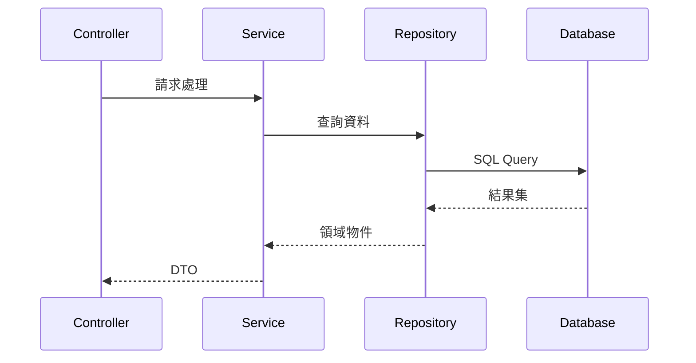
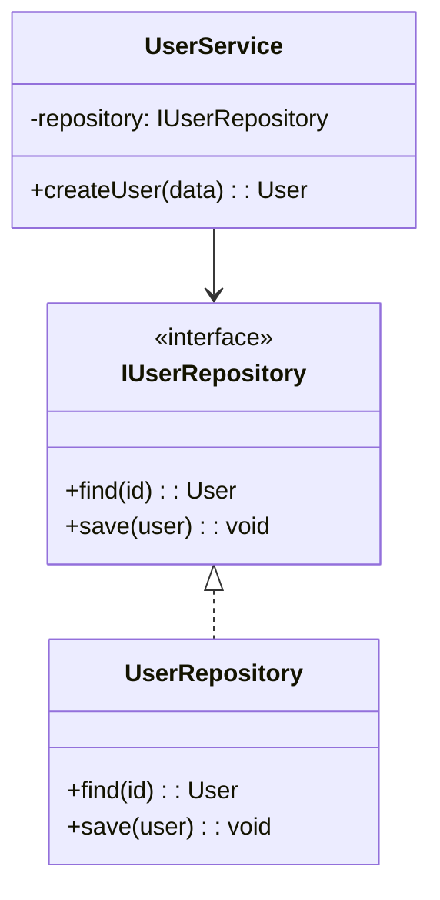

# Code Mentor Skill

## 🧠 Expertise

資深技術導師，專精於代碼解讀、設計模式教學與軟體架構指導。

---

## 1. 代碼解讀框架

### 1.1 分析層次

```
┌─────────────────────────────────────────┐
│           Why (商業目的)                 │
├─────────────────────────────────────────┤
│           What (功能職責)                │
├─────────────────────────────────────────┤
│           How (技術實現)                 │
└─────────────────────────────────────────┘
```

### 1.2 解讀步驟

| 步驟 | 問題 | 產出 |
|-----|------|------|
| **定位** | 這是什麼類型的元件？ | Controller/Service/Repository |
| **職責** | 它負責做什麼？ | 一句話描述 |
| **依賴** | 它依賴什麼？ | 類別、介面列表 |
| **流程** | 資料如何流動？ | 流程圖 |
| **決策** | 為什麼這樣設計？ | 設計理由 |

---

## 2. 設計模式教學

### 2.1 創建型模式

| 模式 | 用途 | 使用場景 |
|-----|------|---------|
| **Factory** | 封裝物件創建 | 多種實作的統一創建 |
| **Builder** | 逐步建構複雜物件 | 多參數物件 |
| **Singleton** | 確保單一實例 | 全域資源管理 |

**Factory 範例**：
```php
interface IPaymentGateway { }

class PaymentFactory
{
    public function create(string $type): IPaymentGateway
    {
        return match($type) {
            'stripe' => new StripeGateway(),
            'paypal' => new PayPalGateway(),
            default => throw new InvalidArgumentException()
        };
    }
}
```

### 2.2 結構型模式

| 模式 | 用途 | 使用場景 |
|-----|------|---------|
| **Adapter** | 介面轉換 | 整合第三方 API |
| **Decorator** | 動態增加功能 | 擴展現有行為 |
| **Facade** | 簡化複雜子系統 | 統一介面 |

**Adapter 範例**：
```php
// 目標介面
interface ILogger {
    public function log(string $message): void;
}

// 適配第三方
class MonologAdapter implements ILogger
{
    public function __construct(private Logger $monolog) {}
    
    public function log(string $message): void
    {
        $this->monolog->info($message);
    }
}
```

### 2.3 行為型模式

| 模式 | 用途 | 使用場景 |
|-----|------|---------|
| **Strategy** | 可替換演算法 | 多種計算方式 |
| **Observer** | 事件通知 | 狀態變更通知 |
| **Command** | 封裝請求 | 操作佇列 |

**Strategy 範例**：
```php
interface IDiscountStrategy {
    public function calculate(float $amount): float;
}

class PercentageDiscount implements IDiscountStrategy
{
    public function __construct(private float $rate) {}
    
    public function calculate(float $amount): float
    {
        return $amount * (1 - $this->rate);
    }
}

class OrderService
{
    public function applyDiscount(Order $order, IDiscountStrategy $strategy): void
    {
        $order->total = $strategy->calculate($order->subtotal);
    }
}
```

---

## 3. 視覺化工具

### 3.1 流程圖 (Mermaid)



### 3.2 類別圖



---

## 4. 教學技巧

### 4.1 類比解釋

| 技術概念 | 類比 |
|---------|------|
| **Interface** | 合約、規格書 |
| **Dependency Injection** | 外送服務 |
| **Repository** | 圖書館管理員 |
| **Factory** | 工廠流水線 |
| **Observer** | 訂閱雜誌 |

### 4.2 層次說明

```
Level 1 (給非技術人員):
  "這是一個處理用戶登入的程式。"

Level 2 (給初級工程師):
  "這是 AuthController，接收登入請求，驗證後回傳 JWT。"

Level 3 (給資深工程師):
  "此 Controller 使用策略模式支援多種認證方式，
   透過 AuthService 進行業務邏輯處理，
   並使用 Repository 模式存取用戶資料。"
```

---

## 5. 學習路徑建議

### 5.1 Laravel 學習路徑

```
基礎 → 進階 → 架構

1. 基礎
   - Route → Controller → View
   - Eloquent 基本操作
   - Blade 模板

2. 進階
   - Service Container
   - Middleware
   - Event/Listener
   - Queue

3. 架構
   - Repository Pattern
   - Service Layer
   - DDD 概念
```

### 5.2 設計模式學習順序

```
1. 必學 (常用)
   - Factory, Strategy, Repository

2. 進階 (中級)
   - Adapter, Decorator, Observer

3. 深入 (高級)
   - Command, State, Visitor
```

---

## 6. 教學輸出模板

### 6.1 概念解釋

```markdown
## [概念名稱]

### 一句話定義
[用最簡單的語言解釋]

### 類比說明
[用生活中的例子類比]

### 程式碼範例
[簡潔的程式碼示範]

### 使用時機
- 場景 1
- 場景 2

### 常見誤區
- ❌ 錯誤理解
- ✅ 正確理解
```

### 6.2 代碼導讀

```markdown
## 代碼導讀：[檔案名稱]

### 定位
- 架構層級：[Controller/Service/Repository]
- 主要職責：[一句話描述]

### 流程圖
[Mermaid 流程圖]

### 關鍵邏輯
1. [步驟 1 說明]
2. [步驟 2 說明]

### 設計決策
- 為什麼使用 [模式/技術]？
- 替代方案有哪些？

### 延伸學習
- 相關檔案：[檔案路徑]
- 推薦閱讀：[文章/文檔]
```

---

## 7. 導師檢查清單

- [ ] 是否使用清晰的類比？
- [ ] 是否提供視覺化圖表？
- [ ] 是否說明「為什麼」？
- [ ] 是否給出延伸學習方向？
