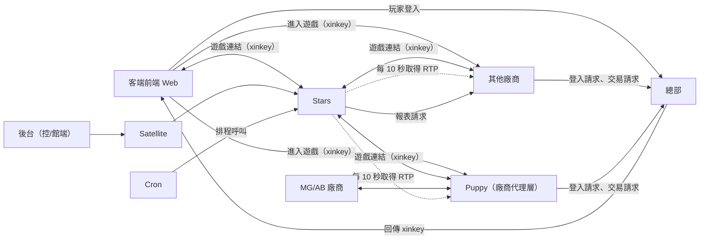
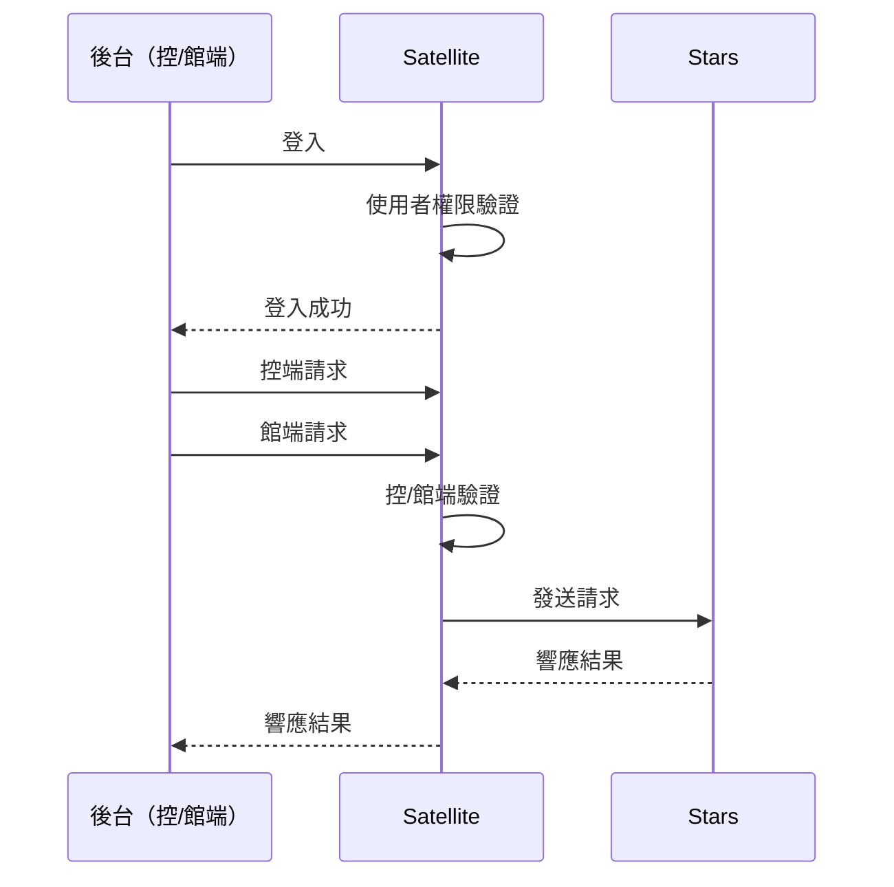
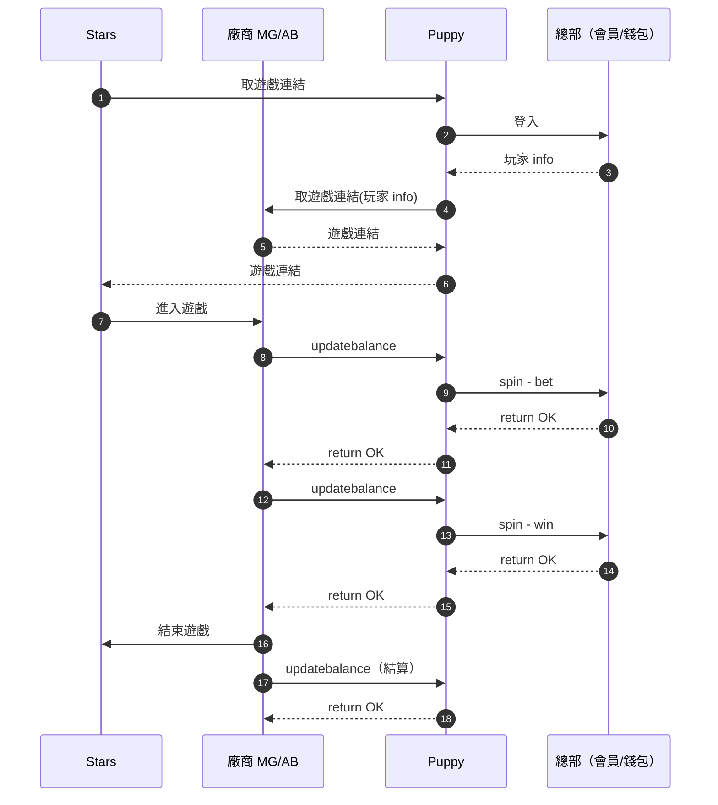

# Stars 系統架構說明

## 系統整體概觀

Stars 是一個 **遊戲平台後端系統**，主要負責：

- **遊戲供應商整合**：取得遊戲連結、RTP、報表等
- **遊戲內容管理**：多站台的遊戲與供應商狀態控制
- **後台報表**：數據統計、日報表、月報表
- **作為客端遊戲平台與各遊戲供應商之間的中間層**

會員、錢包、登入驗證等功能由 **總部** 負責，Stars 本身不直接處理。

## 系統組成

### 外部系統

- **客端（多站台 Web 遊戲平台）**
    - 有多個營運平台，依各平台不同，取得對應的顯示資料
    - 取得顯示資料，如：遊戲分類列表、遊戲列表與遊戲資訊（維護狀態、RTP）等
    - 與總部登入後進行長連線，取得 `xinkey` 後續向 Stars 請求遊戲連結進入遊戲
    - 記錄使用者點擊、近期遊玩、搜尋記錄
- **特例站台（遊戲測試）**
    - **前哨站（outpost）**
        - 正式環境
        - 遊戲上線前測試
        - 僅供特定 IP
        - 白名單帳號可以取得未上架遊戲、維護中遊戲
    - **QC 站**
        - 測試環境
        - 分海內與海外站（qc oversea）
        - 僅供開放廠商白名單進行遊戲測試
- **後台**
    - **控端**
        - 管理多個站台資料與狀態
        - 使用者權限管理
        - 遊戲供應商、遊戲資料管理
        - 遊戲供應商與遊戲狀態總開關
        - 報表查詢
    - **管端（營運平台）**
        - 管理單一站台
        - 遊戲供應商與遊戲狀態站台開關
        - 報表查詢
- **總部（星城、Game Server）**
    - 會員、錢包、登入驗證
    - 提供廠商遊戲下注、派彩、餘額查詢 API
    - 遊戲供應商報表查詢
- **Platform（廠商、遊戲供應商）**
    - 主動串接 Stars
    - 與總部完成登入/交易
- **Platform MG/AB（MG/AB 廠商）**
    - 由我們反串接
    - 使用 Puppy 作為中間層

### 內部系統

- **Satellite （後台系統）**
    - 接收各個站台後台的 API 請求
    - 區分控端與館端，分別呼叫 stars 對應 api
    - 與 Stars 透過內網溝通，操作站台、廠商、遊戲狀態，取得報表
    - 擁有內部會員系統（僅後台使用）
- **Stars（核心遊戲後端）**
    - 與各遊戲廠商 API 溝通
    - 取遊戲連結
    - 製作報表
    - 控制 web 站台、廠商、遊戲狀態
- **Puppy（廠商代理層、橋接器）**
    - 我方主動串接 MG/AB 協議，作為 Stars 與 MG/AB 之間的代理層
    - 對 Stars 來說等同於廠商角色
    - 與總部進行長連線處理登入/交易
- **Cron（排程機）**
    - 排程呼叫 stars api 製作報表、遊戲排序、更新廠商 RTP

## 架構圖



## 請求流程圖

### 客端

- **取得遊戲連結流程（先登入/先給連結）**
    1. **先登入才給連結**：遊戲廠商收到 Stars 取遊戲連結請求時，向總部發送登入請求，成功後回傳 Stars 遊戲連結。

        ```mermaid
        sequenceDiagram
          autonumber
          participant ClientFE as 客端
          participant HQ as 總部（會員/錢包）
          participant Stars as Stars
          participant Vendor as 遊戲供應商

          ClientFE->>HQ: 登入請求
          HQ-->>ClientFE: 回傳 xinkey
          ClientFE->>Stars: 攜帶 xinkey 請求遊戲連結
          Stars->>Vendor: 要求遊戲連結
          Vendor->>HQ: 登入
          HQ-->>Vendor: 玩家 info
          Vendor-->>Stars: 遊戲連結
          Stars-->>ClientFE: 遊戲連結
          ClientFE->>Vendor: 開啟遊戲
          Note over Vendor,HQ: 下注/派彩/餘額查詢均由 遊戲供應商 ↔ 總部 溝通
          Vendor->>ClientFE: 結束遊戲

        ```

    2. **先給連結才登入**：遊戲廠商收到 Stars 取遊戲連結請求時，先回傳遊戲連結給 Stars，玩家開啟遊戲後向總部發送登入請求。

        ```mermaid
        sequenceDiagram
          autonumber
          participant ClientFE as 客端
          participant HQ as 總部（會員/錢包）
          participant Stars as Stars
          participant Vendor as 遊戲供應商

          ClientFE->>HQ: 登入請求
          HQ-->>ClientFE: 回傳 xinkey
          ClientFE->>Stars: 攜帶 xinkey 請求遊戲連結
          Stars->>Vendor: 要求遊戲連結

          Vendor-->>Stars: 遊戲連結
          Stars-->>ClientFE: 遊戲連結
          ClientFE->>Vendor: 開啟遊戲
          Vendor->>HQ: 登入
          HQ-->>Vendor: 玩家 info
          Note over Vendor,HQ: 下注/派彩/餘額查詢均由 遊戲供應商 ↔ 總部 溝通
          Vendor->>ClientFE: 結束遊戲

        ```


### 後台



### Puppy



## 系統架構關鍵概念

### 核心組件定義
- **Stars**: Laravel 9.x 核心遊戲後端系統，負責遊戲供應商整合與管理
- **Satellite**: 後台管理系統，提供控端與館端介面
- **Puppy**: MG/AB 廠商代理層，作為 Stars 與 MG/AB 之間的橋接器
- **總部**: 會員、錢包、登入驗證系統（星城、Game Server）
- **Platform**: 遊戲供應商，主動串接 Stars
- **客端**: 多站台 Web 遊戲平台前端

### 資料流程
1. **遊戲連結取得**: 客端 → Stars → Platform/Puppy → 總部
2. **遊戲狀態管理**: Satellite → Stars → Platform
3. **報表生成**: Cron → Stars → Platform
4. **RTP 更新**: Stars → Platform (每 10 秒)

### 技術架構特點
- **多資料庫架構**: stars, report, entry, platform_1, platform_2
- **佇列系統**: Horizon 管理背景任務
- **快取系統**: Redis 多層級快取
- **API 設計**: RESTful API 端點
- **容器化部署**: Podman + Alpine Linux
- **開發環境**: Laravel 內建開發伺服器 (php -S)
