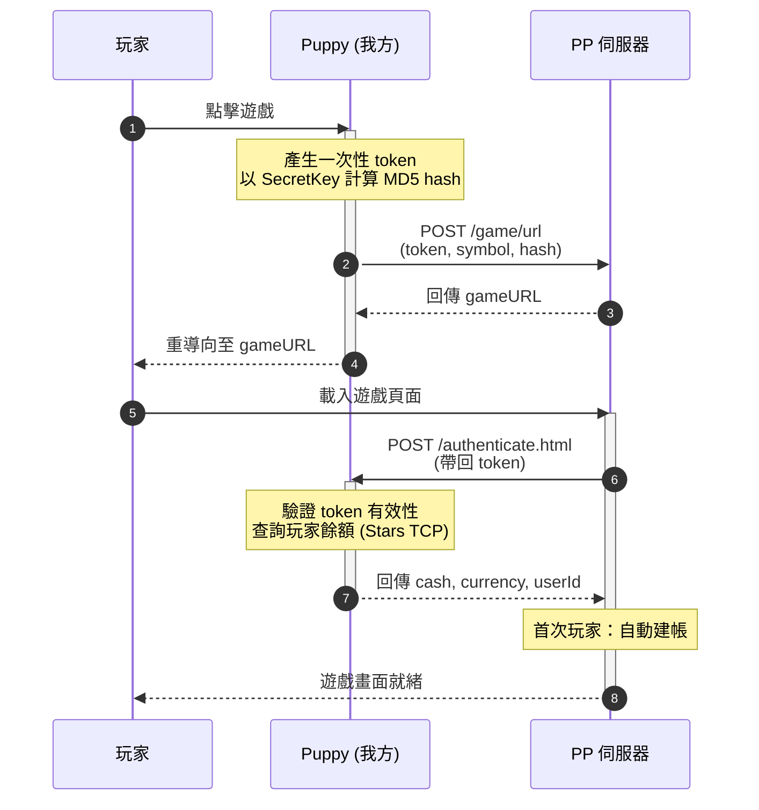
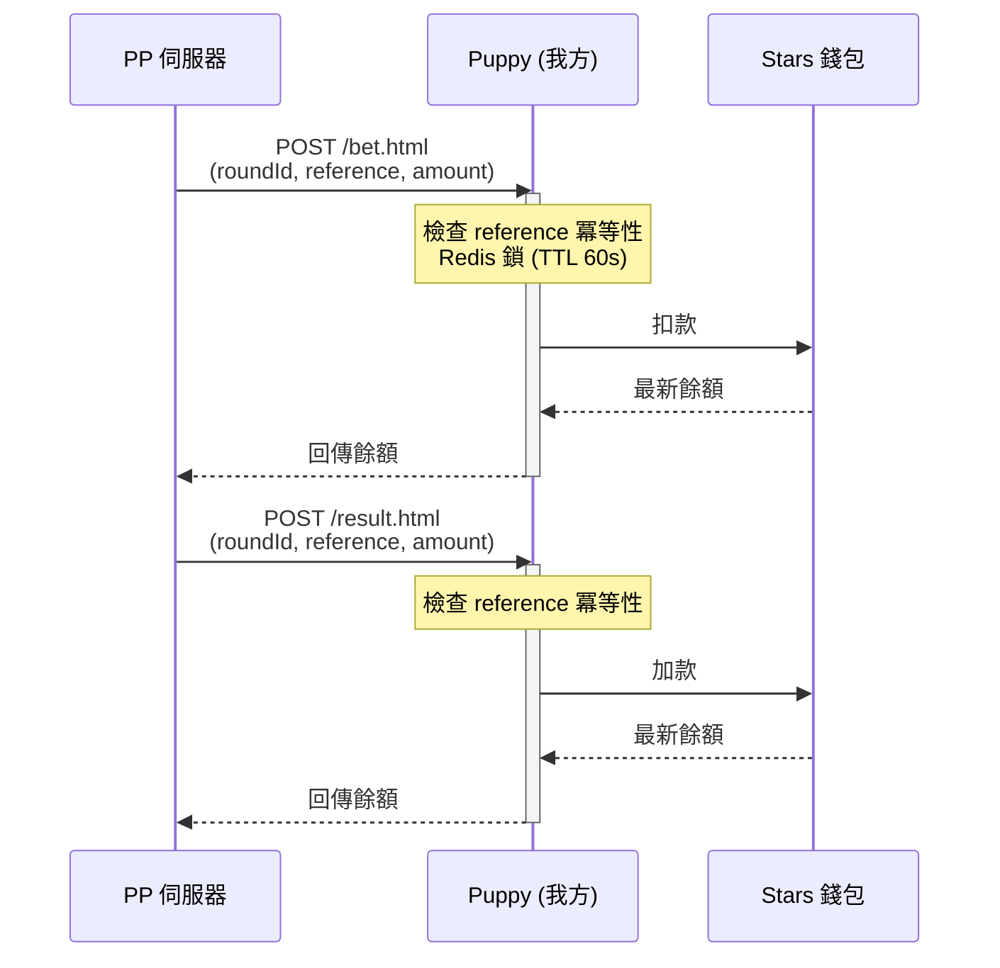
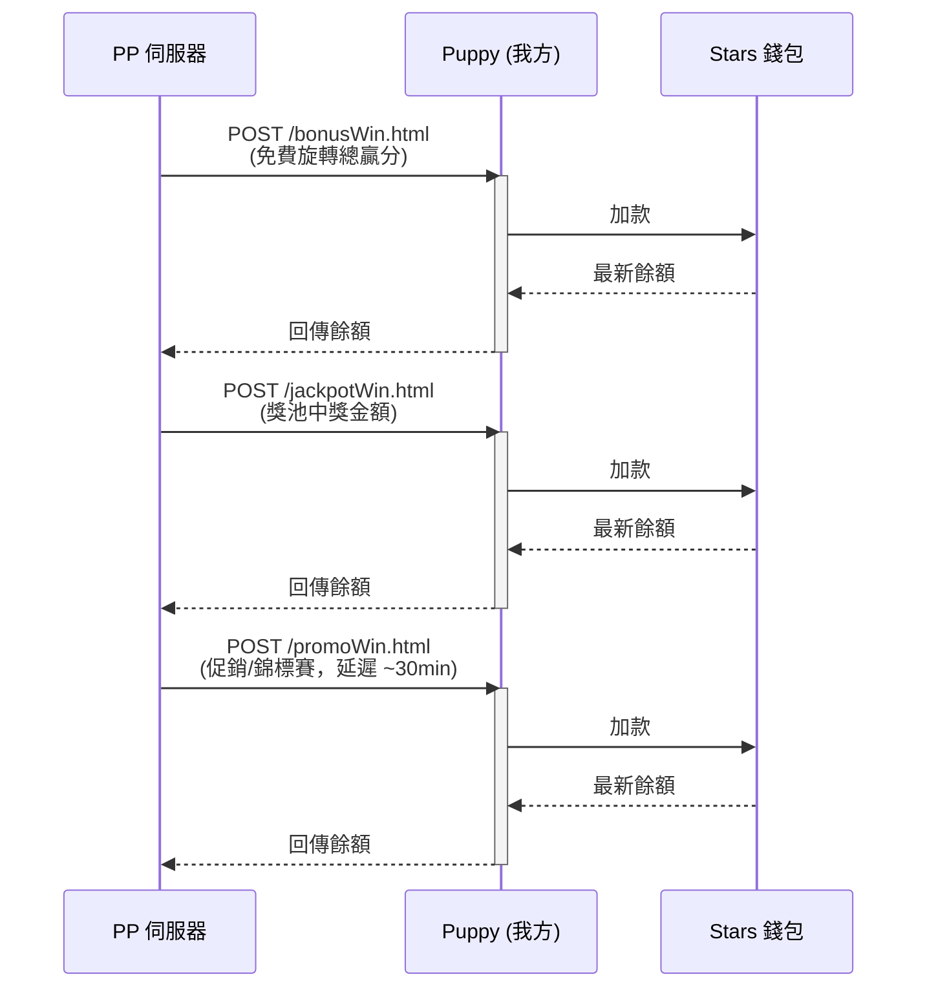
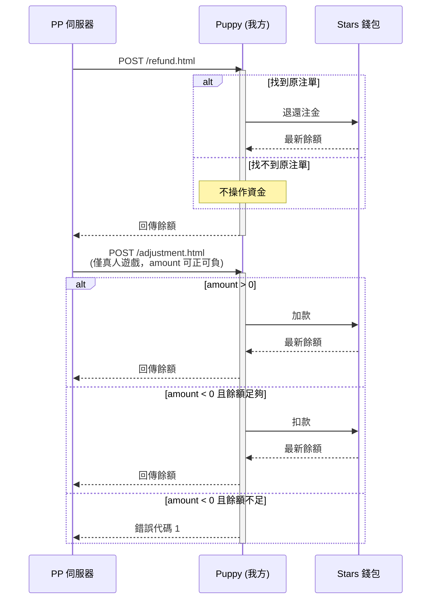

# PP 無縫錢包流程說明

## 第一部分：取得遊戲連結與身分驗證流程

在 PP 的架構中。身分驗證是透過「您主動呼叫取得連結」加上「PP 反向呼叫您的驗證端點」來完成。請**完全忽略舊版文件（圖表 11.1）中在本地端拼湊網址的做法**，亞洲市場強制必須使用 `GameURL API`。

### 流程圖

```
  玩家                      Puppy                    PP 伺服器
   │                        │                            │
   │── 1. 點擊遊戲 ─────────▶│                            │
   │                        │ 產生一次性 token            │
   │                        │ 以 SecretKey 計算 MD5 hash  │
   │                        │                            │
   │                        │── 2. POST /game/url ──────▶│
   │                        │   (token, symbol, hash)    │
   │                        │◀──── 回傳 gameURL ──────────│
   │                        │                            │
   │◀── 3. 重導向至 ─────────│                            │
   │       gameURL          │                            │
   │                        │                            │
   │── 載入遊戲頁面 ──────────────────────────────────────▶│
   │                        │                            │
   │                        │◀── 4. POST /authenticate ──│
   │                        │       (帶回 token)          │
   │                        │                            │
   │                        │ 驗證 token 有效性           │
   │                        │ 查詢玩家餘額 (Stars TCP)    │
   │                        │                            │
   │                        │── 5. 回傳驗證結果 ──────────▶│
   │                        │   (cash, currency, userId) │
   │                        │     首次玩家：自動建帳        |
   │                        │                            │
   │◀──────── 6. 遊戲畫面就緒 ─────────────────────────────│
   │                        │                            │
```

### 時序圖 (Mermaid)



1. 準備靜態驗證參數
   PP 的 API 一律帶入 PP 事先線下配發給您的靜態帳號 `secureLogin`，並透過結合您的專屬 Secret Key 與所有傳遞參數計算出 MD5 `hash` 以驗證身分。

2. 呼叫 GameURL API 取得連結 (`POST /game/url`)
   當玩家點擊遊戲時，您的系統需產生一組玩家專屬的一次性安全令牌 (`token`)，並連同遊戲代碼 (`symbol`) 等參數呼叫此 API。確認無誤後，PP 會回傳一串 `gameURL`，請直接將玩家重導向至此網址。

3. PP 反向呼叫驗證與註冊 (`POST /authenticate.html`)
   玩家載入遊戲網址時，PP 伺服器會帶著剛才的 `token` 反向呼叫您伺服器上架設的此端點。

- 您的動作：核對該 `token` 是否有效。若有效，回傳玩家的真實餘額 (`cash`)、幣別 (`currency`) 與玩家 ID (`userId`) 等資訊給 PP。
- 自動註冊機制：若該玩家是初次遊玩，PP 系統中沒有他的帳號，PP 會直接利用您這次回傳的資料，在他們系統中**自動建立新帳戶**，取代傳統的註冊/登入流程。

---

## 第二部分：常規核心交易流程

在交易處理上，您必須清楚區分兩個核心欄位：

- `roundId` (回合 ID)：代表玩家單次完整的遊戲局，一局遊戲從頭到尾共用同一個 roundId。
- `reference` (交易參考號)：代表單筆資金異動（下注、派彩等）。一局內會有多個不重複的 `reference`。**您的系統必須以 `reference` 來實作「冪等性（Idempotency）」防重複處理機制**。

### 流程圖

```
  PP 伺服器                    Puppy                   Stars 錢包
       │                        │                            │
       │                        │                            │
═══════╪════════════════════════╪════ 一般下注與派彩 ══════════╪═══════
       │                        │                            │
       │── POST /bet.html ─────▶│ 檢查 reference 冪等性       │
       │   (roundId,reference,  │ Redis 鎖 (TTL 60s)         │
       │    amount)             │── 扣款 ────────────────────▶│
       │                        │◀── 最新餘額 ────────────────│
       │◀── 回傳餘額 ────────────│                            │
       │                        │                            │
       │── POST /result.html ──▶│ 檢查 reference 冪等性       │
       │   (roundId,reference,  │── 加款 ───────────────────▶│
       │    amount)             │◀── 最新餘額 ────────────────│
       │◀── 回傳餘額 ────────────│                            │
       │                        │                            │
```

### 時序圖：一般下注與派彩



1. 一般下注扣款 (`POST /bet.html`)
玩家點擊旋轉時觸發。您的系統需檢查玩家餘額，扣除下注金額 `amount`，並回傳最新餘額。若餘額不足需回傳錯誤代碼 `1`。

2. 一般贏分派彩 (`POST /result.html`)
遊戲得出結果且中獎時觸發，將贏得的 `amount` 加回玩家餘額中。

---

## 第三部分：特殊玩法結算與非同步派彩機制

不同於常規的下注與派彩，以下三種特殊派彩請求**獨立於一般遊戲循環之外**。您的系統極有可能在**玩家已經離線或關閉遊戲**的狀態下，於伺服器背景收到這些請求。因此，實作上**絕對不能依賴玩家端點的連線狀態**，且必須嚴格依賴 `reference` 做好冪等性防重複加錢檢查。

### 流程圖

```
  PP 伺服器                    Puppy                   Stars 錢包
       │                        │                            │
       │                        │                            │
═══════╪════════════════════════╪════ 特殊玩法結算 ════════════╪═══════
       │                        │                            │
       │── POST /bonusWin ─────▶│── 加款 (總贏分) ───────────▶│
       │◀── 回傳餘額 ────────────│◀────────────────────────── │
       │                        │                            │
       │── POST /jackpotWin ───▶│── 加款 (獎池金) ───────────▶│
       │◀── 回傳餘額 ────────────│◀────────────────────────── │
       │                        │                            │
       │── POST /promoWin ─────▶│── 加款 (促銷金) ───────────▶│
       │   (延遲 ~30 分鐘)       │◀────────────────────────── │
       │◀── 回傳餘額 ────────────│                            │
       │                        │                            │
```

### 時序圖：特殊玩法結算



### 1. 免費旋轉總結算 (`POST /bonusWin.html`)

- 機制說明：在免費遊戲期間，系統不會逐次扣除注金。當所有免費次數轉完後，PP 會將「總贏分」一次性透過此 API 發送給您。即使玩家完全沒贏錢，也會發送一筆 `amount = 0.00` 的請求。
- 非同步與離線觸發：此呼叫是**非同步的，且與遊戲回合的結束無關**。如果啟用了「自動完成未完成回合（Auto-finalization）」機制，當玩家在免費旋轉中途斷線且逾時，PP 會在背景自動結算，並直接發送此請求給您的系統。

### 2. 累積大獎派彩 (`POST /jackpotWin.html`) 與獎金拆分

- 機制說明：只要牽涉 Jackpot 獎池中獎，就會獨立走此 API 通知運營商。若遇到網路不穩，透過協調機制，此請求會在背景獨立於遊戲會話持續重試發送給您。
- 「累積」與「非累積」獎金的帳務陷阱：
  - 累積獎金 (Progressive)：隨玩家下注動態增長的獎池。
  - 非累積獎金 (Non-progressive)：大獎的固定種子金額或固定乘數獎金。
  - 預設行為：PP 預設會將這兩筆金額**加總合併**在同一個 `amount` 欄位發送給您。
  - 官方結算規定：在實際的財務對帳中，**PP 官方只會向運營商支付「累積獎金」的部分**。（非累積獎金由運營商自行承擔）。
-   解決方案 (`jackpotDetails`)：為精準對帳，您必須向 PP 技術支持申請啟用 `jackpotDetails` 選填參數。啟用後，請求中會多出一個 JSON 欄位（例如：`{"progressive":100, "non-progressive":50}`），您的系統需解析此欄位，將金額拆分寫入資料庫以利後續財務核對。

### 3. 促銷活動/錦標賽派彩 (`POST /promoWin.html`)

-   **機制說明**：專門用於派發錦標賽獎金、天降獎勵（Prize Drop）或社群大獎（CJP）。
-   **絕對的非同步延遲**：此 API 天生就是非同步發送的。通常在錦標賽結束後，會有約 **30 分鐘的延遲**才會開始派發並執行重試。您的系統必定會在活動結束後、玩家可能離線時，在背景收到此派彩通知。

---

## 第四部分：額度調整與退款

### 流程圖

```
  PP 伺服器                    Puppy                   Stars 錢包
       │                        │                            │
       │                        │                            │
═══════╪════════════════════════╪════ 額度調整與退款 ══════════╪═══════
       │                        │                            │
       │── POST /refund.html ──▶│ 找到原注單？                 │
       │                        │ ├─ 是：退還注金              │
       │                        │ │  ── 加款 ────────────────▶│
       │                        │ └─ 否：不操作               │
       │◀── 回傳餘額 ────────────│                            │
       │                        │                            │
       │── POST /adjustment ───▶│ amount > 0 → 加款          │
       │   (僅真人遊戲)          │ amount < 0 → 檢查餘額       │
       │                        │   餘額不足 → 錯誤代碼 1      │
       │◀── 回傳餘額或錯誤 ───────│                            │
       │                        │                            │
```

### 時序圖 3：額度調整與退款



**1. 退款 (`POST /refund.html`)**
當遊戲異常中斷或未能順利開始時，PP 會發送此請求將注金退還。若您的系統中找不到該筆下注紀錄，不需做任何資金操作，直接回傳成功即可。

**2. 真人遊戲餘額調整 (`POST /adjustment.html`)**
僅限真人遊戲使用。傳入的 `amount` 可正可負（正值加錢、負值扣錢）。若為負值且玩家餘額不足，需回傳錯誤代碼 `1` (`Insufficient balance`) 拒絕扣款。此請求支援離線發送。

---

## 第五部分：選用機制與防呆策略

1. `EndRound` 與 `RoundDetails` 的相依性
    - 每當一個遊戲回合結束時，PP 預設**不強制**發送結束通知。如果您不需要即時結束交易或獲取詳細開獎內容，官方強烈建議**不要串接且禁用 `POST /endRound.html`** 以減輕伺服器負載。
    - 但是，若您的法規或邏輯要求必須接收 `POST /roundDetails.html` (例如取得百家樂的開牌結果或老虎機賠率乘數)，您就**必須**向 PP 申請啟用 `EndRound`，因為 `RoundDetails` 只能在 `EndRound` 之後觸發。
2. 協調算法 (Reconciliation) 帳務同步機制
    - 若 PP 發送的資金請求（如 bet, result）因為網路問題沒有收到您的成功回覆，PP 會每 5 秒重試 1 次，共重試 2 次。
    - 若仍失敗，請求會進入「交易隊列」在背景不斷定時重試（最多 24 小時）。
    - **處理原則**：當您收到重試的請求時，請利用 `reference` 判斷是否已經處理過。如果已處理，**絕對不能重複扣款或加錢**，只要回傳玩家「當下實際的最新餘額」即可結束 PP 的重試機制。
3. 自動完成未完成回合 (Auto-finalization)
    - 若玩家在免費旋轉中途斷線離線，PP 預設會保留進度讓玩家下次登入繼續玩。
    - 如果您（依據過去慣例）希望系統在逾時後自動結算，**必須主動聯絡 PP 技術支持申請開啟並設定逾時時間**。
    - 啟用後，PP 會在背景自動觸發 `/refund.html` (完全沒玩退款) 或 `/bonusWin.html` / `/result.html` (玩了部分並派彩) 結束該回合，您的系統需準備好接收這些非玩家在線時自動發起的帳務異動。
