# 專案架構報告：QC 站 IP 白名單管理系統 (QC IP Whitelist System)

## 1. 系統概述 (Executive Summary)
本系統旨在管理 QC (Quality Control) 測試站的廠商存取權限。透過整合 **Google Cloud Armor** 進行邊緣防護，並結合 **Redis** 進行高效能快取與併發控制，實現對特定遊戲廠商 (Platform) 的 IP 白名單動態管理。

### 核心鏈路圖

```mermaid
graph TD
    Client[API Client / Controller] --> Service[App\Services\Qc]
    Service -- 1. Check Cache / Lock --> Redis[(Redis Cache)]
    Service -- 2. Abstract Call --> Interface[App\Interfaces\IGoogleCloudArmor]
    Interface -- Implements --> Library[App\Library\GoogleCloudArmorApi]
    Library -- 3. REST API (JWT Auth) --> GCP[Google Cloud Armor]
```


---

## 2. 服務層 (Service Layer)
**檔案路徑:** `app/Services/Qc.php`

此層級為業務邏輯中樞，不直接接觸外部 API，而是專注於**策略調度**、**快取一致性**與**併發保護**。

### 2.1 核心職責
1.  **環境策略分流 (Policy Strategy):**
    *   依據 `server_country` (TW/Overseas) 決定讀取哪一組 Cloud Armor Policy (例如 `stars` 或 `member-oversea-qc`)。
2.  **多層級快取 (Multi-Level Caching):**
    *   **Redis Key:** `QC_RULES`, `QC_ALL_IPS`, `QC_PLATFORM_IPS`。
    *   **策略:** 讀取時優先查快取 (Cache-Aside)；寫入成功後**立即更新快取** (Write-Through-ish)，並設定短效 TTL (60s) 以確保前端即時性。
3.  **原子鎖 (Atomic Locking):**
    *   利用 `Redis::setnx` 實作分佈式鎖 (`tryAcquireApiLock`)。
    *   **目的:** 防止短時間內對同一廠商規則進行併發寫入，避免 GCP 回傳 `409 Conflict` 或邏輯錯誤。
4.  **平台代碼映射 (Platform Mapping):**
    *   負責將 DB 中的廠商代碼 (如 `wanin`) 轉換為 GCP 規則描述上的標籤 (如 `遊戲廠商-wanin`)。

### 2.2 關鍵方法
*   `getPlatformByIp($policy, $ip)`: 透過 Redis 內的 IP 列表反查該 IP 屬於哪個廠商。
*   `addIpToRule(...)` / `removeIpFromRule(...)`: 業務入口，封裝了「鎖定 -> 呼叫介面 -> 更新快取 -> 解鎖」的完整流程。

---

## 3. 介面層 (Interface Layer)
**檔案路徑:** `app/Interfaces/IGoogleCloudArmor.php` (推測)

此層級定義了與雲端安全服務互動的契約，實現**依賴反轉 (DIP)**，解耦業務邏輯與基礎設施。

### 3.1 核心定義
介面應包含高階的「智能」操作方法，而非底層 HTTP 方法：
*   `smartAddIpsToRules(...)`: 智能新增 IP (自動處理分拆規則)。
*   `smartRemoveIpsFromRules(...)`: 智能移除 IP (自動處理刪除空規則)。
*   `getFormattedSecurityPolicyRules(...)`: 取得標準化格式的規則列表。
*   `getSecurityPolicy(...)`: 取得原始政策資訊。

---

## 4. 基礎設施層 (Infrastructure Layer)
**檔案路徑:** `app/Library/GoogleCloudArmorApi.php`

此層級為 `IGoogleCloudArmor` 的具體實作，負責處理 GCP Cloud Armor 的技術細節與限制。

### 4.1 身份驗證 (Authentication)
*   **機制:** Service Account JSON Key -> JWT (RS256 簽名) -> OAuth Access Token。
*   **特點:** 不依賴外部 gcloud CLI，透過 PHP 原生 OpenSSL 與 HTTP Client 完成驗證，適合容器化環境。

### 4.2 智能批次演算法 (Smart Batching Logic)
這是此類別最核心的價值，解決了 **Cloud Armor 單一規則最多 10 個 IP** 的限制。

#### A. 新增邏輯 (`smartAddIpsToRules`)
1.  **填補缺口 (Fill):** 掃描現有規則 (e.g., `wanin-1`)，若 IP 數 < 10，則填入新 IP 並 Patch 更新。
2.  **自動擴容 (Expand):** 若現有規則皆滿：
    *   計算下一批次號 (Batch ID)，如 `wanin-2`。
    *   計算下一優先權 (Priority)，如 `max_priority + 1`。
    *   將剩餘 IP 切塊 (`array_chunk(10)`) 建立新規則。

#### B. 移除邏輯 (`smartRemoveIpsFromRules`)
1.  **映射定位:** 找出目標 IP 散落在哪些 Priority 的規則中。
2.  **差集運算:** 計算移除後的剩餘 IP。
3.  **動態決策:**
    *   若 **剩餘 IP > 0**: 更新規則 (Patch)。
    *   若 **剩餘 IP = 0**: 刪除整條規則 (Delete Rule)，避免留下空殼規則佔用配額。

---

## 5. 數據流與互動流程 (Sequence of Operations)

### 場景：後台新增 IP (Add IP)
1.  **Controller:** 接收 Request，驗證參數。
2.  **Service:**
    *   `getPolicyName()`: 確認環境。
    *   `tryAcquireApiLock()`: **[關鍵]** 鎖定該廠商代碼，防止併發衝突。
    *   `getRulesByPlatform()`: 讀取現有規則。
    *   `addIpToRule()`: 呼叫 Interface。
3.  **Infrastructure (Library):**
    *   `smartAddIpsToRules()`: 執行填補或擴容邏輯，呼叫 GCP API。
    *   回傳操作結果。
4.  **Service:**
    *   `updatePlatformIpCache()`: **[關鍵]** 立即將新 IP 寫入 Redis，不等待 GCP 同步。
    *   `removeApiLock()`: 釋放鎖。
5.  **Controller:** 回傳成功訊息。

---

## 6. 導入建議與注意事項

1.  **設定依賴 (Configuration):**
    *   需準備 Google Cloud Service Account JSON Key (具備 Compute Security Admin 權限)。
    *   需定義 `RedisKey` Enum 以統一管理 Cache Keys。

2.  **依賴注入 (DI):**
    *   在 `AppServiceProvider` 中綁定介面與實作：
        ```php
        $this->app->bind(IGoogleCloudArmor::class, function ($app) {
            return new GoogleCloudArmorApi([
                'projectId' => config('google.project_id'),
                'keyFilePath' => config('google.key_path'),
            ]);
        });
        ```

3.  **測試重點:**
    *   **邊界測試:** 針對第 10 個與第 11 個 IP 的新增/移除進行測試，確保自動擴容邏輯正確。
    *   **併發測試:** 模擬同時寫入，驗證 Atomic Lock 是否生效。