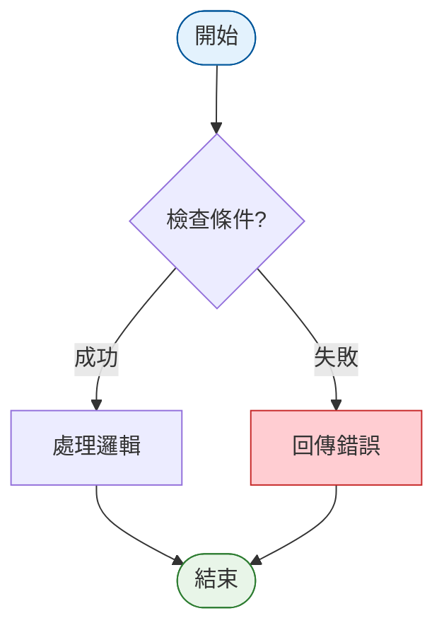
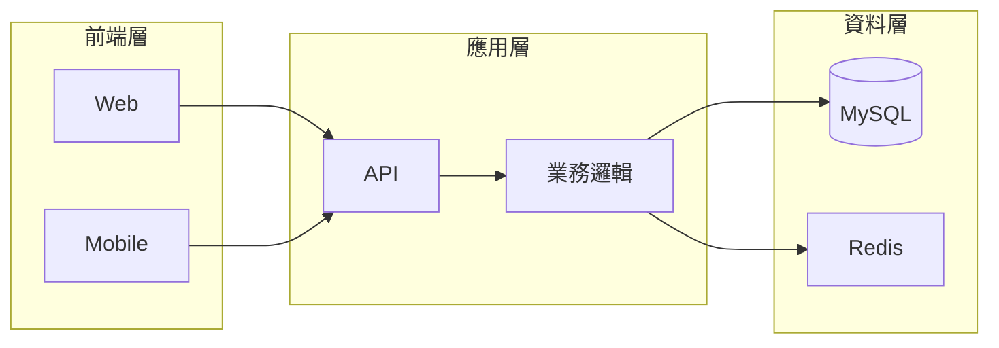
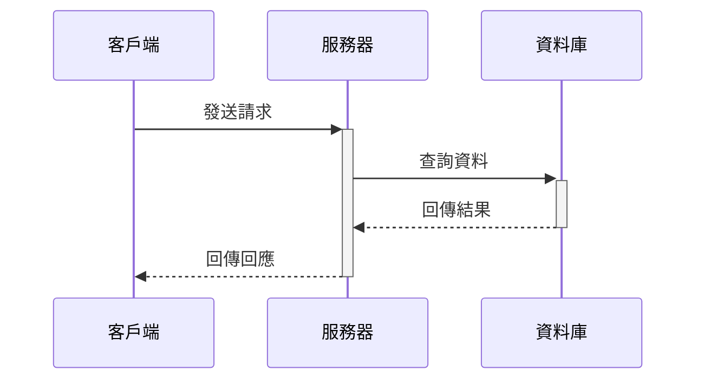
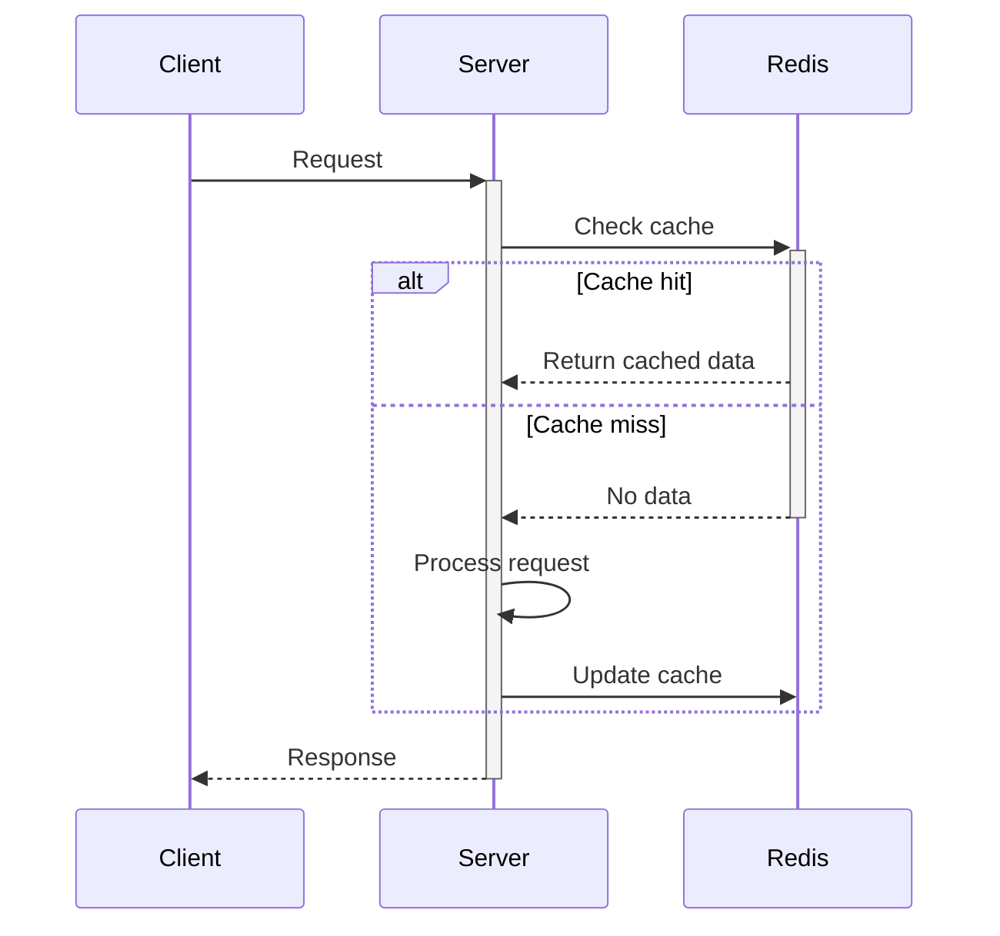
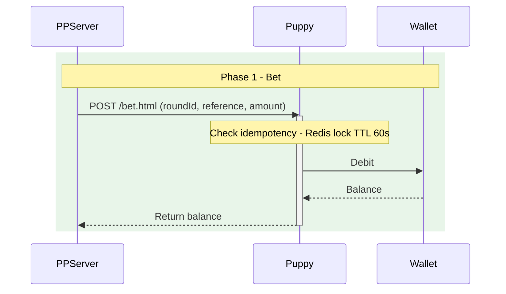
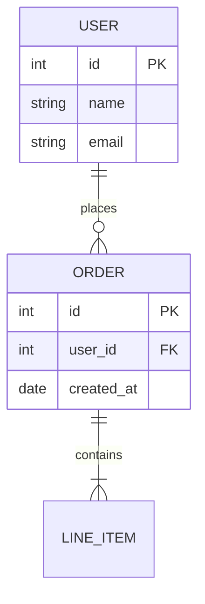
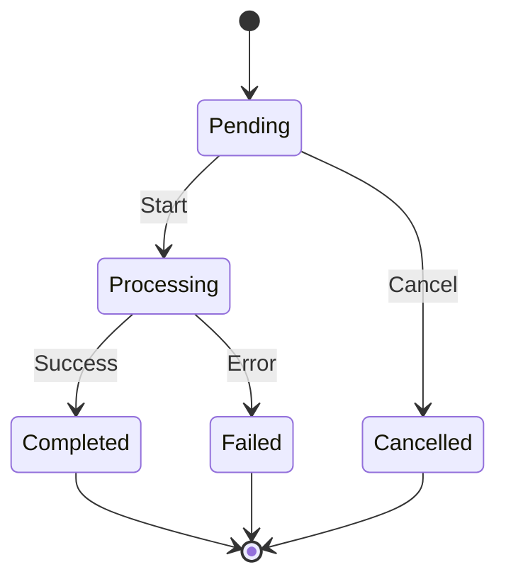
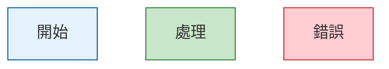

# Mermaid Diagram Skill

## 適用環境

**GitLab 版本**：13.12.15
**Mermaid 版本**：~8.9.x

---

## 1. 支援的圖表類型

| 圖表類型 | 關鍵字 | 支援狀態 |
|---------|--------|---------|
| 流程圖 | `flowchart TD` / `graph TD` | ✅ 完整支援 |
| 序列圖 | `sequenceDiagram` | ✅ 完整支援 |
| 類別圖 | `classDiagram` | ✅ 完整支援 |
| 狀態圖 | `stateDiagram-v2` | ✅ 完整支援 |
| ER 圖 | `erDiagram` | ✅ 完整支援 |
| 甘特圖 | `gantt` | ✅ 完整支援 |
| 圓餅圖 | `pie` | ✅ 完整支援 |
| Git 圖 | `gitGraph` | ⚠️ 實驗性，謹慎使用 |

---

## 2. 絕對禁止（必讀，這些會造成渲染失敗）

### 2.1 sequenceDiagram 的 participant 別名
participant 別名（`as` 後面的文字）支援中文、括號，以下格式均可正常渲染：

```
✅ participant S as Puppy (我方)
✅ participant PP as PP 伺服器
✅ participant S as Puppy
```

### 2.2 `<br/>` HTML 標籤
節點文字和訊息標籤中不得使用 `<br/>`，改用連字號 `-` 分隔。

```
❌ Note over S: 驗證 token<br/>查詢餘額
✅ Note over S: 驗證 token - 查詢餘額
```

### 2.3 條件中的 `<` `>` 符號
`alt/else` 條件敘述中的大小於符號會被解析為 HTML 標籤：

```
❌ alt amount < 0 且餘額不足
✅ alt amount LT 0 and insufficient balance
✅ alt amount is negative
```

### 2.4 Emoji 字元
節點或訊息中不得使用 Emoji：

```
❌ A[🎮 玩家] --> B[💰 主錢包]
✅ A[玩家] --> B[主錢包]
```

### 2.5 全形括號與問號
節點文字中使用半形字元：

```
❌ A{條件？}
✅ A{條件?}
```

### 2.6 複雜 HTML 標籤
```
❌ A[第一行<strong>粗體</strong>]
✅ A[第一行 - 粗體文字]
```

---

## 3. 支援的語法快速參考

### 流程圖節點形狀

| 形狀 | 語法 | 範例 |
|-----|------|------|
| 矩形 | `[文字]` | `A[處理]` |
| 圓角矩形（開始/結束） | `([文字])` | `Start([開始])` |
| 菱形（條件） | `{文字}` | `Check{條件?}` |
| 圓形 | `((文字))` | `Point((節點))` |
| 圓柱體（資料庫） | `[(文字)]` | `DB[(資料庫)]` |
| 平行四邊形（輸入） | `[/文字/]` | `Input[/輸入/]` |

### 連接線類型

| 類型 | 語法 |
|-----|------|
| 實線箭頭 | `-->` |
| 虛線箭頭 | `-.->` |
| 粗線箭頭 | `==>` |
| 雙向箭頭 | `<-->` |
| 帶標籤 | `-->|標籤|` |

---

## 4. 圖表模板

### 4.1 流程圖（業務流程）



### 4.2 系統架構圖（分層）



### 4.3 序列圖（API 互動）



### 4.4 序列圖（含 alt 分支）



### 4.5 序列圖（含 rect 分區）



### 4.6 ER 圖



### 4.7 狀態圖



---

## 5. 樣式設定

### 單一節點樣式


### classDef 批次套用



---

## 6. 品質檢查清單

繪製完成後，逐項確認：

- [ ] 訊息標籤無 `<br/>`、`<`、`>`
- [ ] `alt/else` 條件無 `<`、`>` 符號
- [ ] 無 Emoji 字元
- [ ] 無全形括號 `（）`、全形問號 `？`
- [ ] 節點文字無複雜 HTML
- [ ] 圖表包在 ` ```mermaid ` 代碼塊中
- [ ] 在 https://mermaid.live/ 測試確認渲染正確

---

## 7. 排錯指南

| 錯誤訊息 | 常見原因 | 解法 |
|---------|---------|------|
| `No diagram type detected` | 訊息或條件中含 `<` `>` | 改用 `LT`/`GT` 或文字描述 |
| `Parse error` | `<br/>` 在訊息中 | 改用 ` - ` 分隔 |
| 圖表不渲染 | Emoji 字元 | 移除所有 Emoji |
| 節點顯示異常 | 全形符號 | 改用半形符號 |
