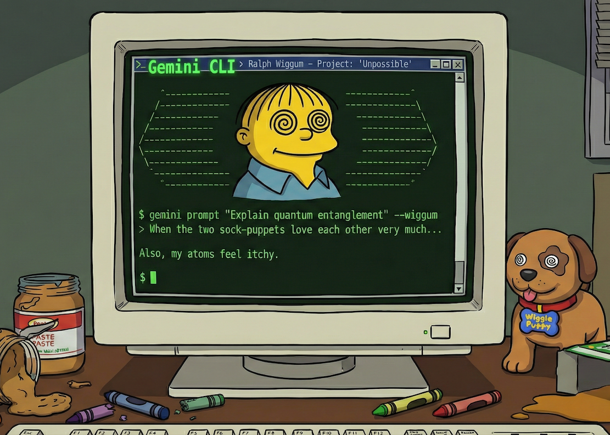

# Ralph Wiggum Extension for Gemini CLI



Ralph Wiggum extension for Gemini CLI implements iterative, self-referential development loops. Named after Ralph Wiggum from The Simpsons, it embodies persistent iteration despite setbacks.

## What is Ralph?

Ralph is a development methodology based on continuous AI agent loops. The technique creates a self-referential feedback loop where Gemini iteratively improves its work until completion.

## Installation

Install the Ralph extension by running *(requires Gemini CLI v0.4.0 or newer)*:

```bash
gemini extensions install https://github.com/gemini-cli-extensions/ralph --auto-update
```

The `--auto-update` is optional: if specified, it will update to new versions as they are released.

## Usage

### Start a Ralph Loop

```bash
/ralph-loop Build a REST API for todos --completion-promise 'DONE' --max-iterations 20
```

### Options

- `--max-iterations <n>` - Stop after N iterations (default: unlimited)
- `--completion-promise '<text>'` - Phrase that signals completion (quote multi-word phrases)

### Cancel a Loop

```bash
/cancel-ralph
```

## Examples

```bash
# Basic loop with iteration limit
/ralph-loop Fix the auth bug --max-iterations 10

# Loop with completion promise
/ralph-loop --completion-promise 'ALL TESTS PASSING' Add unit tests

# Unlimited loop (use with caution)
/ralph-loop Refactor the cache layer
```

## How It Works

1. `/ralph-loop` creates a state file at `.gemini/ralph-loop.local.md`
2. Gemini works on the task iteratively
3. Each iteration, progress is made and tracked
4. Loop ends when:
   - Max iterations reached, OR
   - Completion promise is genuinely true and output

## State File

Monitor progress:
```bash
cat .gemini/ralph-loop.local.md
```

## Philosophy

- **Iteration > Perfection**: Don't aim for perfect on first try
- **Failures Are Data**: Use them to improve
- **Persistence Wins**: Keep trying until success
- **Trust the Process**: Don't circumvent with false completion

## Resources

- [Original Ralph Technique](https://ghuntley.com/ralph/)
- [Gemini CLI](https://github.com/google-gemini/gemini-cli)
- [Gemini CLI Extensions](https://github.com/google-gemini/gemini-cli/blob/main/docs/extensions/index.md)

## License

Apache License 2.0

