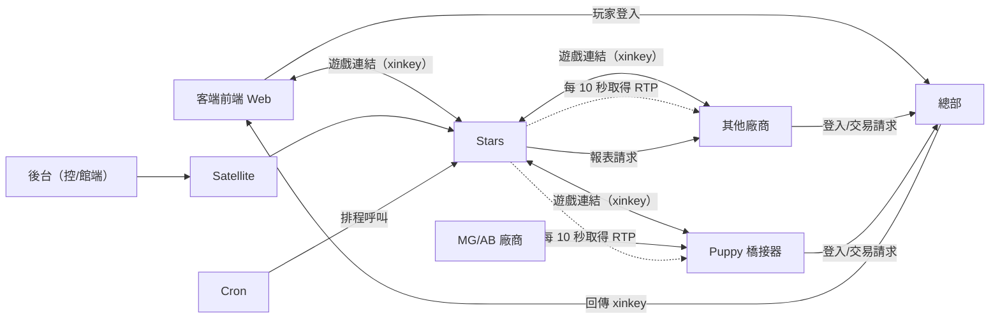
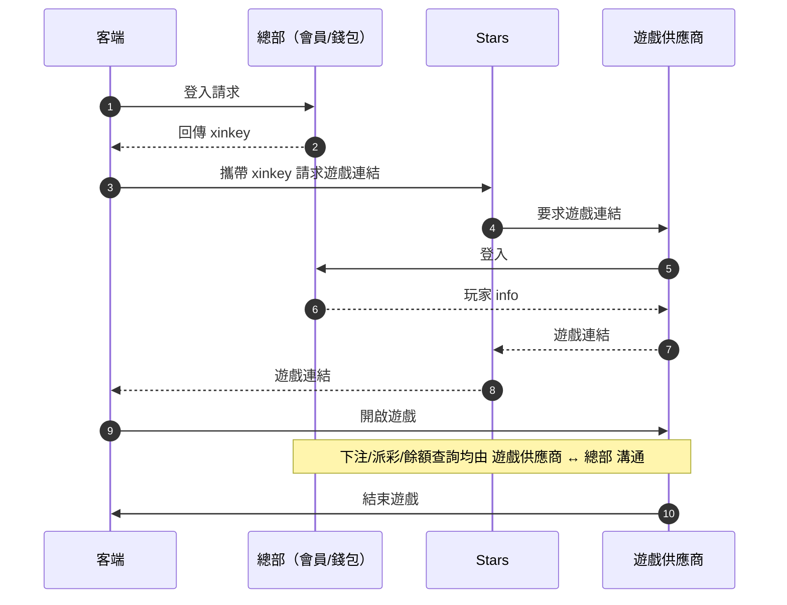
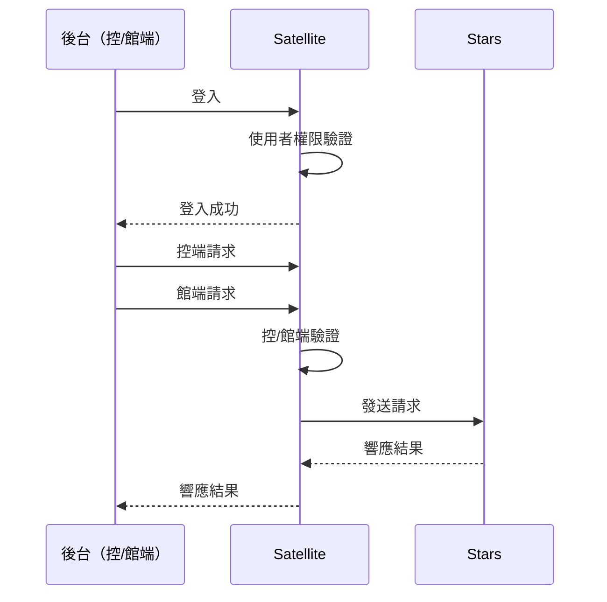

# 🌟 Stars 專案策略 (GEMINI.md)

> 本文件定義 Stars 專案的開發策略、技術架構與領域知識，供 AI Agent 在互動過程中參考。

---

## 1. 專案概覽 (Project Overview)

Stars 是一個 **遊戲平台後端系統**（中間層），基於 **Laravel 9** 開發。主要負責整合多個遊戲供應商 (Platforms)，並提供給不同營運站台 (Providers) 使用。

### 核心職責
- **遊戲供應商整合**：取得遊戲連結、RTP、報表等。
- **遊戲內容管理**：多站台的遊戲與供應商狀態控制。
- **後台報表**：數據統計、日報表、月報表。
- **中間層角色**：作為客端遊戲平台與各遊戲供應商之間的中間層。

---

## 2. 開發環境與容器指令 (Environment)

本專案於 **WSL** 環境下開發，並使用 **Podman** 進行容器化管理。

| 項目 | 值 |
|------|-----|
| 容器名稱 | `stars` |
| 容器內路徑 | `/var/www/html/stars` |
| 服務端口 | `8082` |

### 常用容器指令

| 操作 | 指令 |
|------|------|
| 進入容器 | `podman exec -it stars sh` |
| 查看狀態 | `podman ps` |
| 查看日誌 | `podman logs -f stars` |
| 重啟容器 | `podman restart stars` |
| 停止容器 | `podman stop stars` |

---

## 3. 技術規格 (Technical Stack)

| 類別 | 技術 |
|------|------|
| 後端框架 | Laravel 9.x (PHP 8.0+) |
| 資料庫 | MySQL (多資料庫架構) |
| 快取 | Redis (Predis 驅動) |
| 佇列 | Laravel Horizon |
| API 文檔 | HG ApiDoc (`hg/apidoc`) |
| 第三方套件 | Telegram Bot, Microsoft Teams, GCS, GeoIP2 |

---

## 4. 系統架構規範 (Architecture Norms)

專案遵循標準 MVC 模式並強化了 Service 層，確保業務邏輯與傳輸層分離。

### 4.1 分層職責

| 層級 | 職責 | 注意事項 |
|------|------|----------|
| **Controller** | 請求驗證與回應 | 複雜邏輯須委派 Service |
| **Service** | 核心業務邏輯 | 透過 `app('Service')->init('Name')` 初始化 |
| **Model** | 資料存取與關聯 | - |
| **Interface** | 常數與介面規範 | 如 `IAnnouncement` |

### 4.2 多資料庫架構 (Multi-Database)

專案連接多個資料庫，開發時需注意 `DB::connection()` 的使用：

| 連接名稱 | 用途 |
|----------|------|
| `management` | 主要業務資料 (預設連接) |
| `record` | 操作紀錄 |
| `report` | 統計報表 |
| `entry` | 錢包交易流水 |
| `platform_ab` / `platform_mg` | 特定供應商專用 |

### 4.3 Redis 快取策略
- **Key 格式**: `前綴_描述:變數` (例如 `game_code:1:2345`)
- **功能分層**: 分為應用快取、會話快取、佇列快取與統計快取

---

## 5. 系統組成與後台架構

### 5.1 後台服務分類

後台功能分為 **控端** 與 **管端**，透過 `Satellite` 系統與 `Stars` 通訊：

| 類型 | 路徑 | 權限範圍 |
|------|------|----------|
| 控端 (Control) | `api/backend` | 所有站台資料、狀態、權限、供應商總開關 |
| 管端 (Agent) | `api/backend/agent` | 僅所屬單一站台的開關與報表 |

### 5.2 外部系統關聯

| 系統 | 說明 |
|------|------|
| 客端 (Client FE) | 多個營運平台，請求遊戲列表與連結 |
| 總部 (HQ) | 負責會員、錢包、登入驗證 |
| Platform (廠商) | 提供遊戲與交易 API |
| Puppy (橋接器) | 我方主動串接 MG/AB 協議的代理層 |

---

## 6. 領域知識與業務邏輯 (Domain Knowledge)

### 6.1 術語定義

| 術語 | 定義 |
|------|------|
| Provider (站台) | 指營運平台、管端 |
| Platform (供應商) | 指遊戲廠商（如 MG, AB, FTG） |

### 6.2 金流邏輯

> ⚠️ **專案不處理金流**：所有錢包交易、餘額查詢、下注派彩均由 **總部** 與 **供應商** 直接對接，Stars 內的相關舊邏輯已棄用。

---

## 7. 架構圖 (Architecture)



---

## 8. 請求流程圖 (Request Flows)

### 8.1 客端取得遊戲連結 (先登入才給連結)



### 8.2 後台請求流程



---

## 9. 開發規範 (Conventions)

### 9.1 命名規範 (Naming)

| 項目 | 規範 | 範例 |
|------|------|------|
| 變數/方法 | 小駝峰，動詞開頭 | `getUser`, `calculateTotal` |
| 類別 | 大駝峰 | `GameService`, `PlayerModel` |
| 介面 | 大 `I` 開頭 | `IGame`, `IAnnouncement` |
| Controller/Model/Service 檔案 | PascalCase | `GameController.php` |
| Config/Lang/Resources 檔案 | snake_case | `game_config.php` |

### 9.2 程式碼風格

#### 大括弧規則

```php
// ✅ 正確：函數斷行
public function getUser()
{
    return $this->user;
}

// ✅ 正確：控制結構不斷行
if ($condition) {
    // ...
}

// ❌ 錯誤：函數不斷行
public function getUser() {
    return $this->user;
}

// ❌ 錯誤：控制結構斷行
if ($condition)
{
    // ...
}
```

#### Import 順序

```php
// ✅ 正確順序
use Illuminate\Support\Facades\DB;        // 1. Vendor 核心
use App\Exceptions\NotFoundException;     // 2. Exception
use App\Services\GameService;             // 3. 自定義 Class
use App\Interfaces\IGame;                 // 4. Interface
```

#### 字串使用

```php
// ✅ 正確：純字串使用單引號
$name = 'Stars';
$key = 'game_code';

// ✅ 正確：需要變數插值時使用雙引號
$message = "Welcome, {$name}!";

// ❌ 錯誤：純字串使用雙引號
$name = "Stars";
```

### 9.3 錯誤處理 (Error Handling)

```php
// ✅ 正確：使用具體語意的異常
throw new NotFoundException('Game not found');
throw new ParameterException('Invalid game ID');

// ❌ 錯誤：使用通用 Exception
throw new Exception('Error occurred');
```

**可用的異常類別**：`NotFoundException`, `RuntimeException`, `ParameterException`, `UnauthorizedException`

---

*本文件包含專案核心架構與環境設定，開發時請嚴格遵守。*
